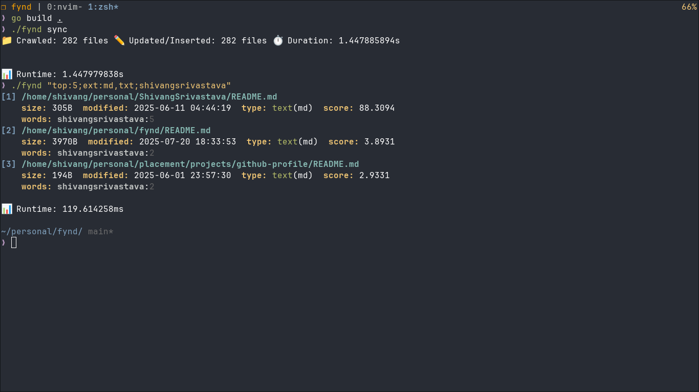

# 🧠 **Fynd** — Smart File Search & Metadata Engine

> A blazing-fast, cross-platform, content-aware file search engine written in Go.

[](https://goreportcard.com/report/github.com/ShivangSrivastava/fynd)


**Fynd** helps you instantly search through your local files with full-text indexing, inline query filters, and a fast, lightweight interface — all powered by Go and SQLite.

---

## 🚀 Features

* ⚡ **Lightning-fast search** using full-text indexing
* 🧠 **Content-aware** filtering
* 🔎 **Inline query syntax** for expressive searches
* 🧰 **Cross-platform** (Linux, macOS, Windows)
* 🧱 Built with Go, Cobra CLI, and SQLite
* 🔄 Optional syncing via command or flag
* 🛠 Configurable via YAML

---

## 📦 Installation

```bash
git clone https://github.com/ShivangSrivastava/fynd.git
cd fynd
go mod tidy
go build .

# Optional: Move binary to your PATH
mv ./fynd ~/.local/bin/
```

---

## 💡 Usage

```bash
❯ fynd help
```

**Fynd** lets you search local files using full-text indexing, with support for:

* **Inline query syntax**
* **Command-line flags**
* **Directory syncing**

### 🔍 Example Queries

```bash
# Inline syntax (preferred)
fynd "top:5;ext:md,txt;error handling"

# Traditional flags
fynd "error handling" --top=3 --ext=log

# Force a sync before search
fynd "panic recover" --sync
```

---

### 🧩 Inline Query Syntax

| Key     | Description                               |
| ------- | ----------------------------------------- |
| `top:N` | Show top N results (`-1` for all)         |
| `ext:X` | Filter by file extensions (`ext:txt,log`) |
| `term`  | Text to search for                        |

---

### 🔧 Commands

```bash
fynd [query] [flags]
fynd [command]

Commands:
  help         Show help for commands
  sync         Rebuild the index from the filesystem
  completion   Generate shell autocompletion scripts

Flags:
  --top int      Show top N results (default from config)
  --ext string   Filter by extensions (e.g. txt,md)
  --sync         Sync before searching
  -h, --help     Show help
```

---

## 📸 Screenshot

[](https://github.com/ShivangSrivastava/fynd)

---

## ⚙️ Configuration

Fynd uses a YAML config file located at:
`~/.config/fynd/config.yml`

### Example:

```yaml
root_path: /home/user/documents
db_path: /home/user/.local/share/fynd/index.db
top: 10
max_concurrency: 150
include_hidden: false
include_dirs: []
exclude_dirs:
  - .git
  - node_modules
  - vendor
```

### 🔍 Config Options

| Key               | Description                                |
| ----------------- | ------------------------------------------ |
| `root_path`       | Directory to crawl and index               |
| `db_path`         | Path to SQLite DB file                     |
| `top`             | Default number of search results           |
| `max_concurrency` | Number of goroutines (performance tuning)  |
| `include_hidden`  | Index dotfiles (e.g. `.env`, `.gitignore`) |
| `include_dirs`    | Explicit directories to include            |
| `exclude_dirs`    | Directories to ignore during crawling      |

> ✅ *Config values can be overridden by CLI flags or inline query syntax.*

---

## 🧠 How It Works

Fynd has a simple, 3-layer architecture:

1. **Crawling**
   Recursively walks through the file tree from the `root_path`, identifying text files.

2. **Indexing**
   Reads file content and stores searchable data in an SQLite full-text index (`db_path`).

3. **Serving (CLI interface)**
   Parses queries and fetches fast results from the indexed data.

> Fynd is **case-insensitive** and currently does **not support regex**. 

---

## 🛠 Tech Stack

* 🐹 Go (golang)
* ⚙️ [Cobra](https://github.com/spf13/cobra) for CLI
* 🗃 [SQLite3](https://sqlite.org/)

---

## 📄 License

MIT License.
See [`LICENSE`](./LICENSE) for details.

---

## 🤝 Contributing

PRs and suggestions welcome!
If you find a bug or want a feature, open an [issue](https://github.com/ShivangSrivastava/fynd/issues).
